*Praktikum 1: Eksperimen Tipe Data List*

1. 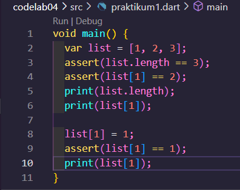

2. Program ini menunjukkan bahwa list pada Dart dapat diakses dan diubah setelah dibuat. Nilai elemen list bisa dimodifikasi, dan assert digunakan untuk memastikan kondisi tertentu saat pengembangan. Output program menampilkan panjang list, nilai sebelum dan sesudah perubahan.

3. Ubah kode pada langkah 1 menjadi variabel final yang mempunyai index = 5 dengan default value = null. Isilah nama dan NIM Anda pada elemen index ke-1 dan ke-2. Lalu print dan capture hasilnya.

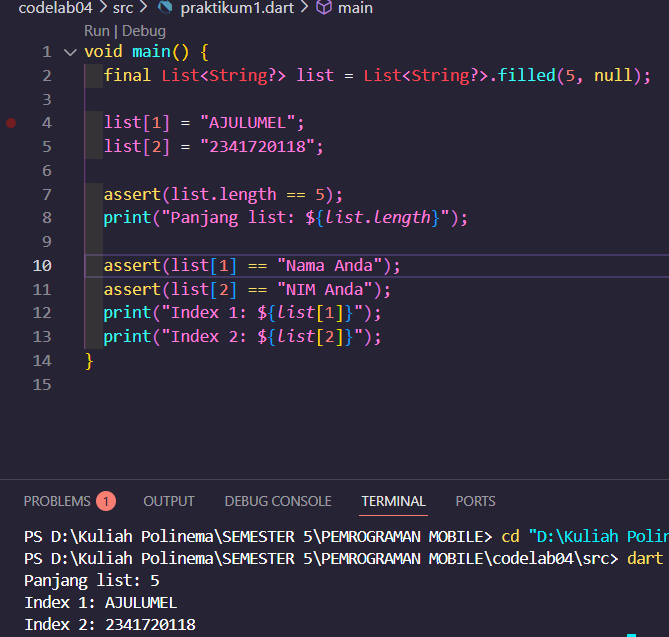

program membuat sebuah list dengan 5 elemen yang awalnya bernilai null, lalu mengisi nama dan NIM pada index ke-1 dan ke-2.

*Praktikum 2: Eksperimen Tipe Data Set*

1. 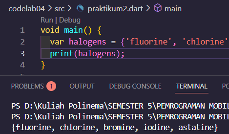

2.  program membuat sebuah set bernama halogens yang berisi nama-nama unsur halogen, lalu menampilkan seluruh isi set tersebut ke layar

3. 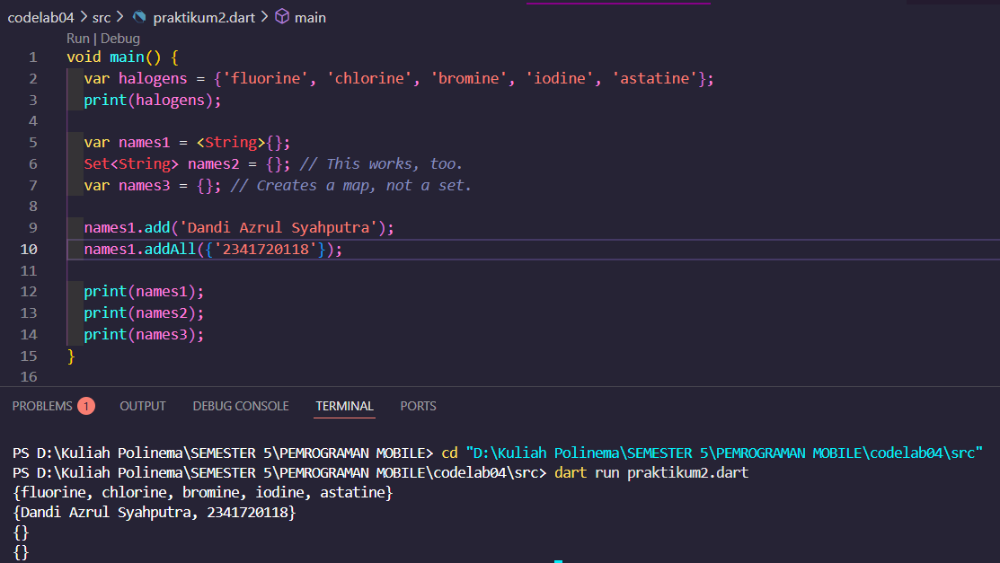

program mendemonstrasikan cara membuat dan memanipulasi variabel bertipe Set di Dart. Elemen nama dan NIM berhasil ditambahkan ke variabel names1 menggunakan fungsi .add() dan .addAll().

*Praktikum 3: Eksperimen Tipe Data Maps*

1. 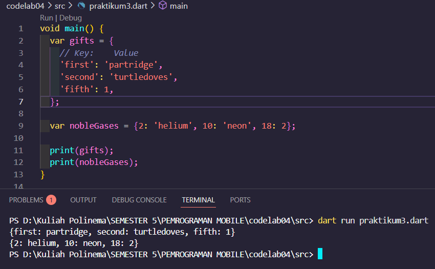

2. program mendemonstrasikan cara membuat dan menampilkan struktur data Map di Dart. Variabel gifts dan nobleGases berisi pasangan key-value dengan tipe data yang berbeda.

3.1 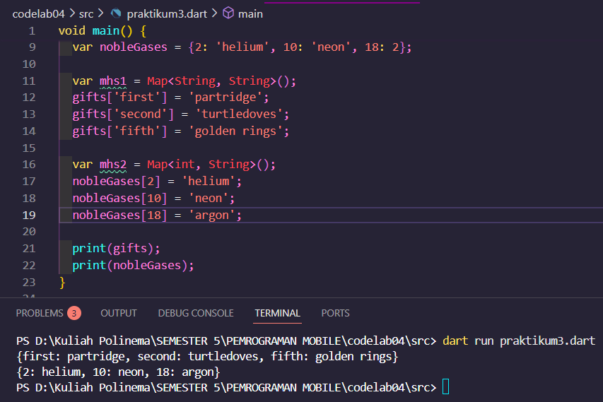

Kode di atas membuat dua variabel bertipe Map, yaitu gifts dan nobleGases, yang masing-masing berisi pasangan key-value dengan tipe data berbeda. Program kemudian menampilkan isi kedua Map tersebut ke layar menggunakan print().

3.2 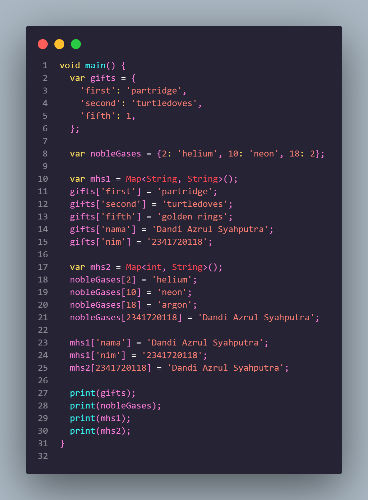

Kode di atas mendemonstrasikan penggunaan struktur data Map di Dart dengan berbagai tipe key dan value. Pada variabel gifts, nobleGases, mhs1, dan mhs2, program menambahkan data nama dan NIM menggunakan key yang sesuai, baik bertipe String maupun int.

*Praktikum 4: Eksperimen Tipe Data List: Spread dan Control-flow Operators*

1. 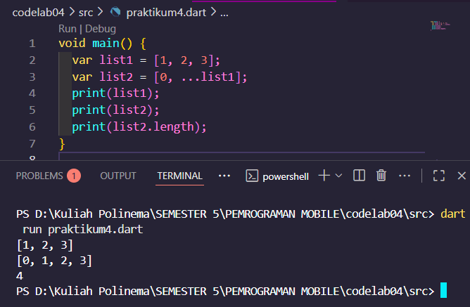

2. Kode di atas menunjukkan cara menggunakan spread operator (...) pada list di Dart untuk menggabungkan isi list lain ke dalam list baru. List list1 berisi tiga elemen, lalu list2 dibuat dengan menambahkan angka 0 di awal dan seluruh isi list1 setelahnya.

3. 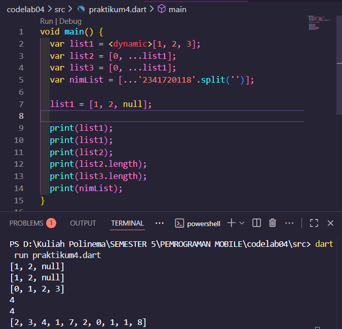

Kode di atas mendemonstrasikan penggunaan spread operator pada list di Dart, serta fleksibilitas tipe data dengan List<dynamic>. List list1 dapat berisi nilai campuran, termasuk null, tanpa error. Spread operator digunakan untuk membuat list baru (list2, list3, dan nimList) dengan menggabungkan isi list lain atau string yang dipecah menjadi karakter. 

4. 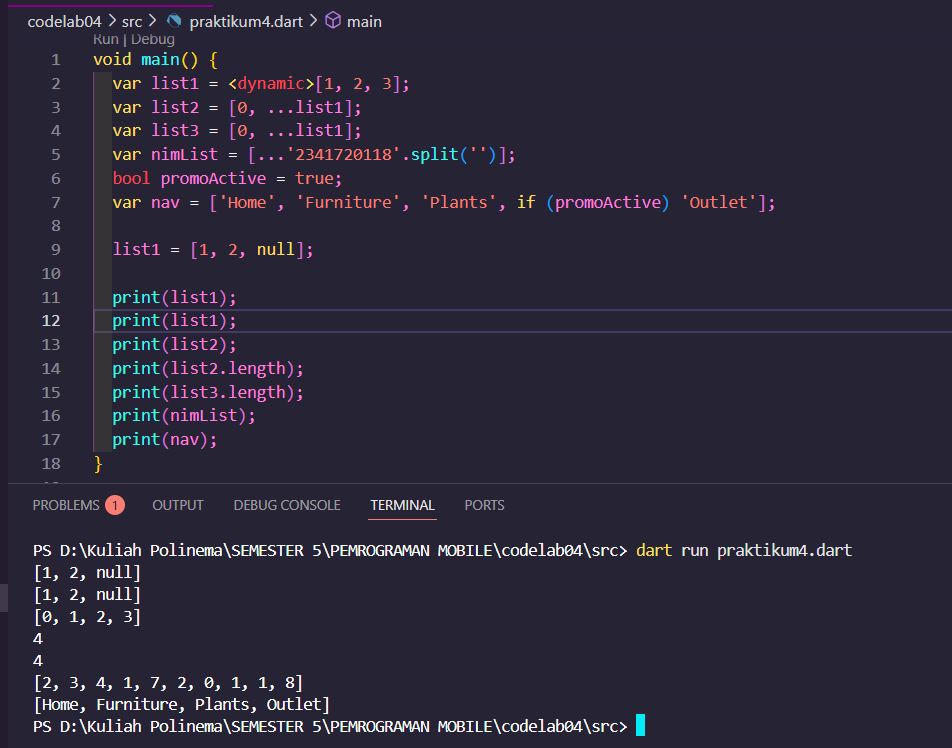

Jika promoActive = true, hasil nav adalah:

['Home', 'Furniture', 'Plants', 'Outlet']

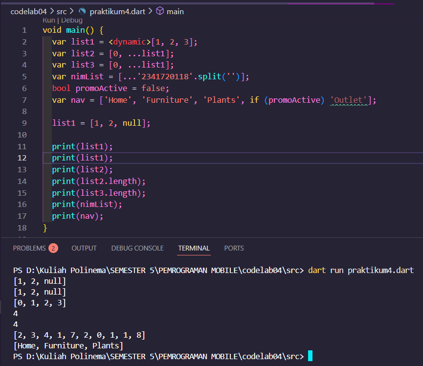

Jika promoActive = false, hasil navFalse adalah:

['Home', 'Furniture', 'Plants']

Jadi, elemen 'Outlet' hanya muncul di list jika promo aktif (true).

5. 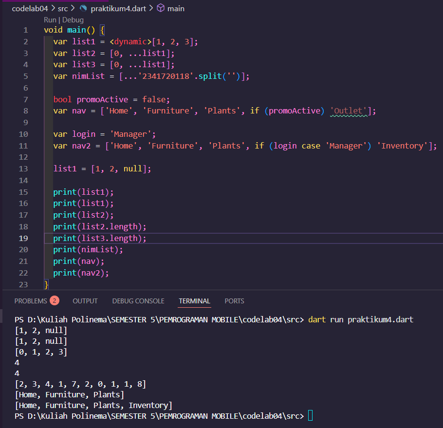

ika login = 'Manager', maka nav2 berisi:
['Home', 'Furniture', 'Plants', 'Inventory']

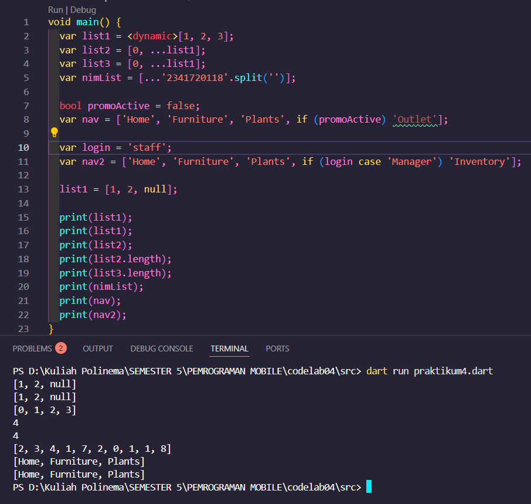

Jika login = 'Staff', maka nav2Staff berisi:
['Home', 'Furniture', 'Plants']

6. 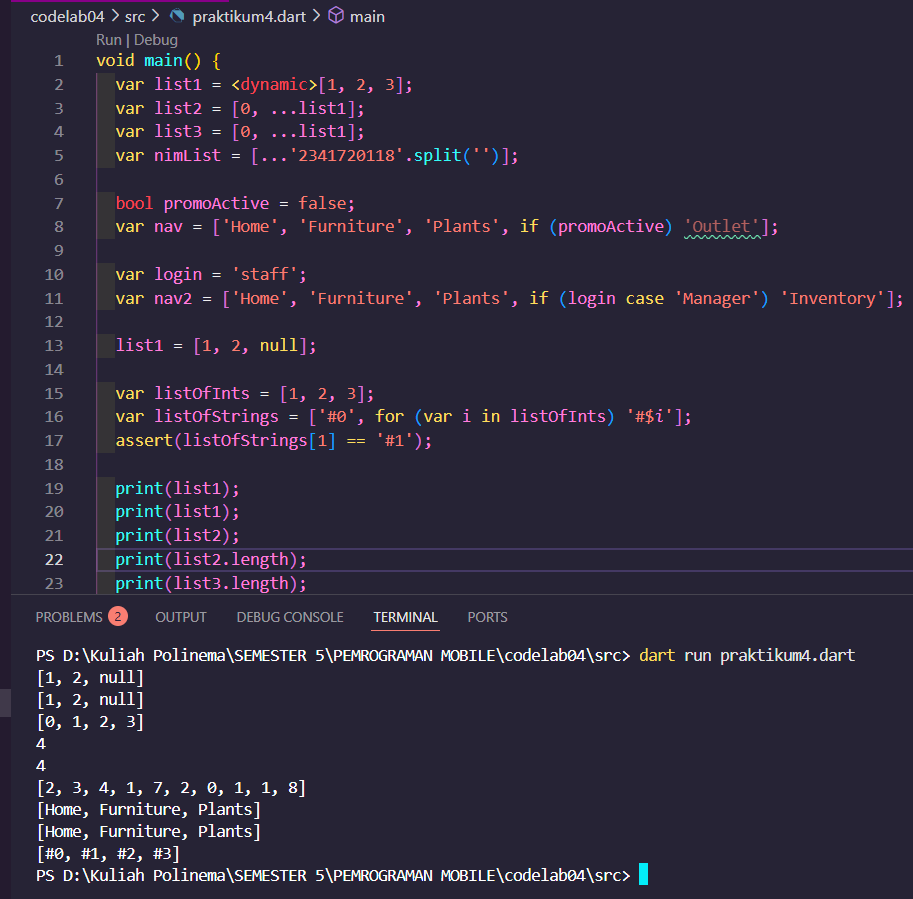

Kode tersebut menggunakan Collection For untuk membuat list baru listOfStrings dari listOfInts, sehingga setiap angka diubah menjadi string dengan format '#angka' secara langsung dalam deklarasi list. Cara ini membuat proses transformasi list lebih ringkas dan efisien tanpa perlu loop terpisah.

*Praktikum 5: Eksperimen Tipe Data Records*

1. 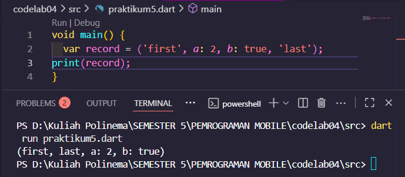

2. Kode di atas mendemonstrasikan fitur record di Dart, yaitu struktur data yang dapat menyimpan beberapa nilai dengan urutan dan label berbeda dalam satu variabel. Record ini berisi dua nilai tanpa label dan dua nilai dengan label (a dan b), lalu seluruh isi record ditampilkan ke layar.

3. 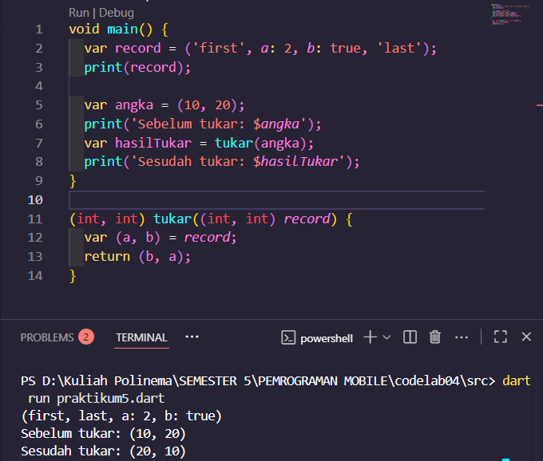

fungsi tukar() digunakan di dalam main() untuk menukar nilai pada record (10, 20), sehingga proses pertukaran value field pada Records dapat terlihat dengan jelas melalui output sebelum dan sesudah pertukaran.

4. 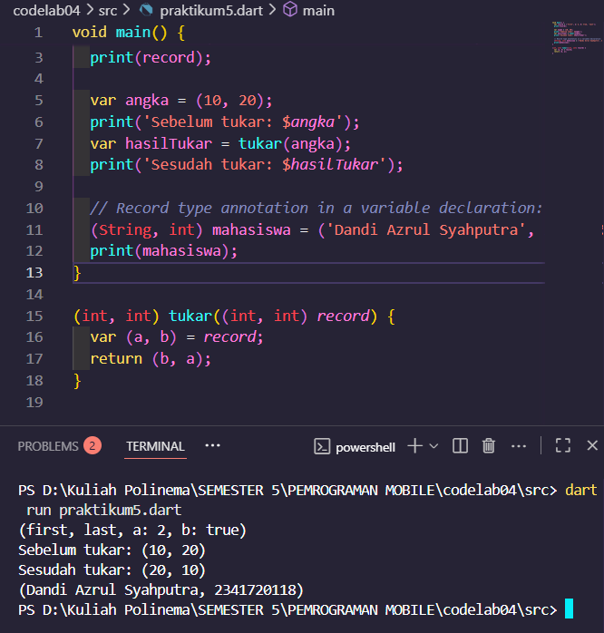

Kode di atas mendemonstrasikan cara menggunakan record di Dart untuk menyimpan data mahasiswa berupa nama dan NIM dalam satu variabel bertipe (String, int). Record ini diinisialisasi dengan nilai 'Dandi Azrul Syahputra' dan 2341720118

5. 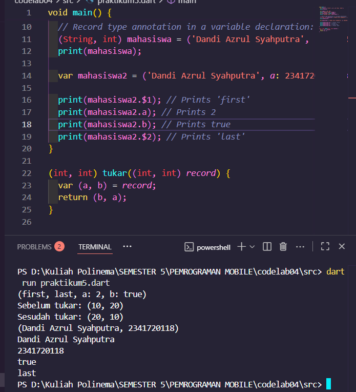

Kode di atas membuat record mahasiswa2 yang berisi nama dan NIM Anda pada field pertama dan field a, lalu menampilkan masing-masing field dengan akses menggunakan $1, .a, .b, dan $2.

*TUGAS PRAKTIKUM*

2. Functions adalah blok kode yang dapat dipanggil berulang kali untuk menjalankan tugas tertentu. Functions memudahkan pengorganisasian dan penggunaan ulang kode.

3. Jenis-jenis parameter di Functions

- Positional parameter: Parameter yang urutannya penting.

void greet(String name, int age) {}

- Optional positional parameter: Parameter yang boleh tidak diisi, ditandai dengan [ ].

void greet(String name, [int age]) {}

- Named parameter: Parameter yang dipanggil dengan nama, ditandai dengan { }.

void greet({String name, int age}) {}

- Default value: Parameter yang punya nilai default.

void greet({String name = 'Guest'}) {}

4. Functions sebagai first-class objects
Artinya, function bisa disimpan dalam variabel, dikirim sebagai parameter, dan dikembalikan dari function lain.

void sayHello() => print('Hello');
var greet = sayHello; // disimpan di variabel
greet(); // memanggil function lewat variabel

5. Anonymous Functions
Anonymous function adalah function tanpa nama, biasanya digunakan sebagai parameter atau callback.

var list = [1, 2, 3];
list.forEach((item) {
  print(item);
});

6. - Lexical scope: Variabel hanya bisa diakses di area (scope) tempat variabel itu dideklarasikan.

void main() {
  int x = 10;
  void printX() {
    print(x); // x bisa diakses
  }
  printX();
}

- Lexical closure: Function yang “mengikat” variabel dari scope di atasnya, sehingga variabel tetap bisa diakses walau scope aslinya sudah selesai.

Function makeAdder(int addBy) {
  return (int i) => i + addBy;
}
var add2 = makeAdder(2);
print(add2(3)); // Output: 5

7. Return multiple value di Functions Gunakan record atau tuple (Dart 3) atau return Map/List.

// Dengan record (Dart 3)
(String, int) getData() {
  return ('Nama', 123);
}
var hasil = getData();
print(hasil.$1); // 'Nama'
print(hasil.$2); // 123
