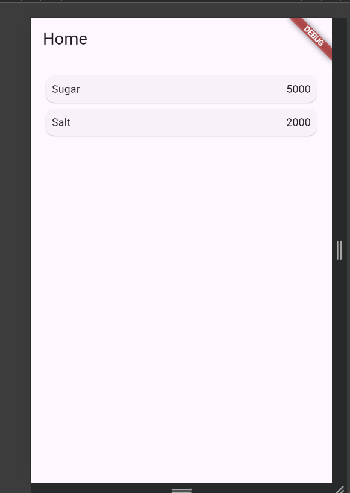
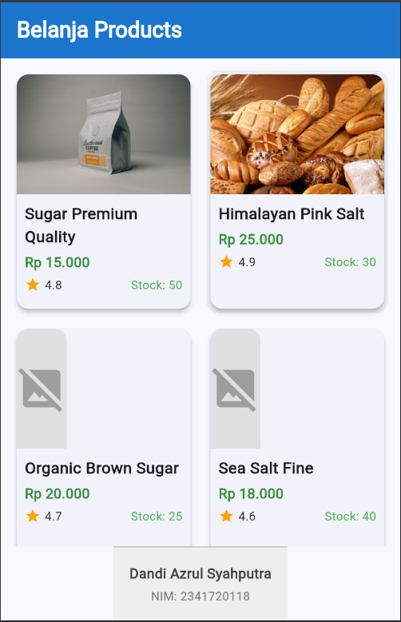

# Belanja App - Shopping Application

Aplikasi belanja sederhana yang dibuat dengan Flutter sebagai bagian dari Praktikum 5: Navigasi dan Rute.

- **Nama:** Dandi Azrul Syahputra
- **NIM:** 2341720118

## Fitur Aplikasi

### ✨ Fitur Utama
1. **GridView Product Listing** - Menampilkan produk dalam grid 2 kolom seperti marketplace
2. **Hero Animation** - Animasi transisi gambar produk yang smooth saat navigasi
3. **Detail Product Page** - Halaman detail lengkap dengan informasi produk
4. **Go Router** - Menggunakan plugin go_router untuk navigasi modern
5. **Rating & Stock** - Menampilkan rating dan stok produk
6. **Responsive UI** - Tampilan yang menarik dan responsif

### 📱 Halaman

#### Home Page
- GridView dengan 2 kolom
- Card produk dengan:
  - Gambar produk (dengan Hero widget)
  - Nama produk
  - Harga (format Rupiah)
  - Rating (bintang)
  - Stok tersedia
- Footer dengan nama dan NIM

#### Item Page
- Hero animation dari Home Page
- Detail lengkap produk:
  - Gambar besar produk
  - Nama produk
  - Rating dan status stok
  - Harga dengan format yang jelas
  - Deskripsi produk
  - Tombol "Add to Cart"


## Screenshot Aplikasi

### Praktikum 5 - Navigasi dan Rute

*Screenshot implementasi navigasi dan routing dengan go_router*

### Tugas Praktikum 2

*Screenshot tampilan aplikasi dengan GridView, Hero animation, dan detail produk*

## Implementasi Teknis

### 1. Model Enhancement
Item model diperluas dengan atribut:
```dart
class Item {
  String name;
  int price;
  String imageUrl;  // Gambar produk
  int stock;        // Stok tersedia
  double rating;    // Rating produk
}
```

### 2. Go Router Configuration
```dart
final GoRouter _router = GoRouter(
  initialLocation: '/',
  routes: [
    GoRoute(path: '/', builder: (context, state) => HomePage()),
    GoRoute(
      path: '/item',
      builder: (context, state) {
        final item = state.extra as Item;
        return ItemPage(item: item);
      },
    ),
  ],
);
```

### 3. Hero Animation
Implementasi Hero widget untuk transisi gambar yang smooth antara HomePage dan ItemPage.

### 4. Component Breakdown
- `ProductCard` - Komponen kartu produk yang reusable
- `FooterWidget` - Komponen footer terpisah
- Pemisahan logic dan UI untuk maintainability

## Navigasi
- Tap pada produk di Home Page → Navigasi ke Item Page dengan data produk
- Back button di Item Page → Kembali ke Home Page
- Menggunakan `context.go()` dari go_router

---

**Praktikum 5: Navigasi dan Rute**  
Program Studi Teknik Informatika  
Politeknik Negeri Malang
