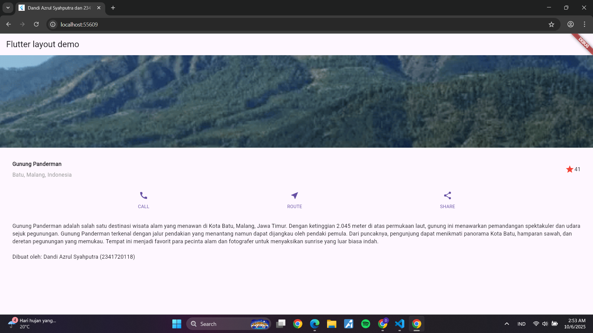

# layout_flutter

A new Flutter project - Flutter Layout Demo

**Nama:** Dandi Azrul Syahputra  
**NIM:** 2341720118  
**Kelas:** TI-3F

## Deskripsi Proyek

Proyek ini adalah implementasi layout Flutter yang menampilkan informasi wisata Gunung Panderman di Batu, Malang. Aplikasi ini dibuat sebagai bagian dari praktikum pemrograman mobile untuk mempelajari konsep layout dan widget di Flutter.

## Fitur Aplikasi

- **Title Section**: Menampilkan judul dan lokasi wisata dengan rating
- **Image Section**: Foto pemandangan Gunung Panderman
- **Button Section**: Tombol aksi (CALL, ROUTE, SHARE)
- **Text Section**: Deskripsi lengkap tentang Gunung Panderman

## Screenshots

### Praktikum 1 - Title Section

### Praktikum 2 - Button Section  

### Praktikum 3 - Text Section

### Praktikum 4 - Final Layout

## Getting Started

This project is a starting point for a Flutter application.

A few resources to get you started if this is your first Flutter project:

- [Lab: Write your first Flutter app](https://docs.flutter.dev/get-started/codelab)
- [Cookbook: Useful Flutter samples](https://docs.flutter.dev/cookbook)

For help getting started with Flutter development, view the
[online documentation](https://docs.flutter.dev/), which offers tutorials,
samples, guidance on mobile development, and a full API reference.
