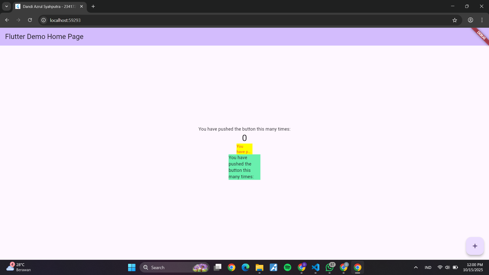

# flutter_plugin_pubdev

Nama : Dandi Azrul Syahputra
Kelas : TI - 3F
No. absen : 07

# Jawaban Praktikum

- Plugin auto_size_text berhasil diintegrasikan

- RedTextWidget bekerja dengan baik

- Custom widget berhasil dibuat dan dapat digunakan kembali (reusable)

**Jawaban soal langkah 2**

Perintah untuk menginstall plugin/package auto_size_text yang akan digunakan dalam project Flutter.

**Jawaban soal langkah 4**

Setelah Anda menambahkan kode di atas, Anda akan mendapatkan info error. Mengapa demikian?

Error terjadi karena package auto_size_text belum diimport meskipun sudah ditambahkan sebagai dependency. 

**Jawaban soal langkah 5**

Menambahkan variabel text dan constructor agar RedTextWidget dapat menerima teks dari luar (parent widget) saat dibuat, membuat widget lebih fleksibel dan reusable.

**Jawaban soal langkah 6**

Menambahkan 2 container di halaman untuk membandingkan RedTextWidget (custom widget dengan auto_size_text) dan Text biasa, dengan lebar berbeda untuk menunjukkan efek auto-sizing.

**Jawaban soal 5**

Parameter plugin auto_size_text berdasarkan dokumentasi:

| Parameter | Tipe | Default | Deskripsi |
|-----------|------|---------|-----------|
| `text` | String | - | Teks yang akan ditampilkan |
| `style` | TextStyle? | null | Styling teks (warna, font, ukuran, dll) |
| `minFontSize` | double | 12 | Ukuran font minimum saat auto-resize |
| `maxFontSize` | double | double.infinity | Ukuran font maksimum yang diizinkan |
| `maxLines` | int? | null | Jumlah maksimal baris yang ditampilkan |
| `overflow` | TextOverflow | clip | Cara menangani teks berlebih (clip, fade, ellipsis, visible) |
| `textAlign` | TextAlign? | null | Alignment teks (left, right, center, justify) |
| `textDirection` | TextDirection? | null | Arah teks (ltr, rtl) |
| `stepGranularity` | double | 1 | Langkah penurunan ukuran font saat auto-resize |
| `presetFontSizes` | List\<double\>? | null | Daftar ukuran font yang sudah ditentukan |
| `group` | AutoSizeGroup? | null | Sinkronkan ukuran font beberapa AutoSizeText |
| `wrapWords` | bool | true | Apakah kata dapat dipotong atau utuh per baris |

## Getting Started

This project is a starting point for a Flutter application.

A few resources to get you started if this is your first Flutter project:

- [Lab: Write your first Flutter app](https://docs.flutter.dev/get-started/codelab)
- [Cookbook: Useful Flutter samples](https://docs.flutter.dev/cookbook)

For help getting started with Flutter development, view the
[online documentation](https://docs.flutter.dev/), which offers tutorials,
samples, guidance on mobile development, and a full API reference.
