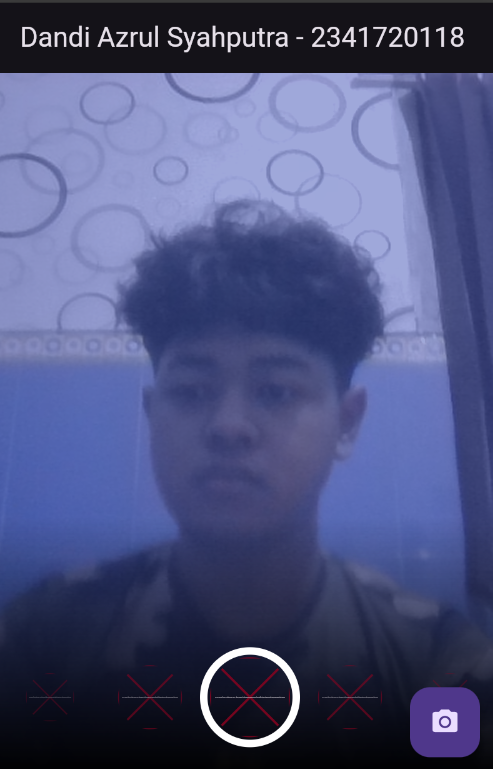

# Dandi Azrul Syahputra
# TI - 3F / 07
# 2341720118

3. async/await di main dipakai agar inisialisasi plugin dan kamera selesai sebelum runApp.

4. - @immutable memastikan widget/kelas tidak berubah setelah dibuat (field final).

- @override memberi tahu analyzer bahwa kamu benar-benar sedang meng-override method dari superclass, sekaligus melindungi dari kesalahan penulisan.

# kamera_with_filter

Flutter project untuk Praktikum 1 & 2: Mengambil Foto dengan Filter secara Real-time.

## Fitur

- Pratinjau kamera dengan filter warna yang bisa dipilih secara langsung di layar kamera
- Filter carousel di bagian bawah layar untuk memilih berbagai filter warna
- Ambil foto dengan filter yang telah dipilih
- Tampilkan hasil foto dengan filter yang telah diterapkan

1) Cara menggunakan:

- Aplikasi akan langsung membuka kamera
- Geser filter carousel di bagian bawah untuk memilih filter warna
- Preview kamera akan menampilkan efek filter secara real-time
- Tekan tombol kamera (FAB) untuk mengambil foto
- Foto yang diambil akan ditampilkan dengan filter yang telah dipilih

## Konfigurasi Platform

- Android: minSdk diset ke 21 (lihat `android/app/build.gradle.kts`).
- iOS: Tambahan izin akses Kamera & Mikrofon pada `ios/Runner/Info.plist`.

## Struktur Kode Penting

- `lib/main.dart` – Entry point app, inisialisasi kamera, langsung buka TakePictureScreen.
- `lib/widget/takepicture_screen.dart` – Layar kamera dengan filter selector terintegrasi, FAB untuk mengambil foto.
- `lib/widget/displaypicture_screen.dart` – Menampilkan hasil foto dengan filter dari path.
- `lib/widget/filter_selector.dart` – Selector filter (scrollable + ring) yang digunakan di layar kamera.
- `lib/widget/filter_item.dart` – Item lingkaran pratinjau filter.
- `lib/widget/carousel_flowdelegate.dart` – FlowDelegate untuk efek carousel.
- `lib/widget/filter_carousel.dart` – Widget photo filter carousel (standalone, tidak digunakan dalam mode gabungan).

## Penggabungan Fitur

Kedua praktikum telah digabungkan menjadi satu:
- Praktikum 1 (Kamera) dan Praktikum 2 (Filter) sekarang terintegrasi dalam satu layar
- User dapat memilih filter secara real-time saat preview kamera aktif
- Filter yang dipilih langsung diterapkan pada foto yang diambil

Catatan: Beberapa API mungkin menunjukkan peringatan deprecation pada SDK terbaru, tapi tetap berfungsi untuk tujuan praktikum.
