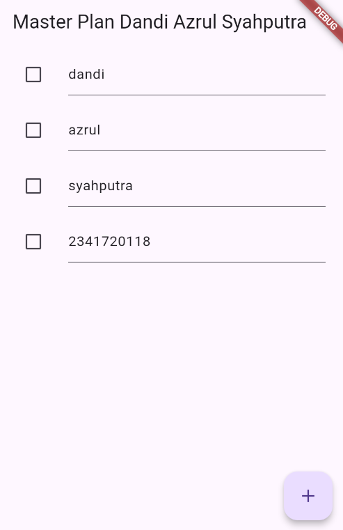

# master_plan

2. Jelaskan maksud dari langkah 4 pada praktikum tersebut! Mengapa dilakukan demikian?

Langkah 4 (data_layer.dart): Membuat barrel file agar impor model cukup satu baris. Mempermudah maintenance, mengurangi repetisi import plan.dart dan task.dart di banyak file.

3. Mengapa perlu variabel plan di langkah 6 pada praktikum tersebut? Mengapa dibuat konstanta ?

Variabel plan (Langkah 6): Menyimpan state kumpulan Task yang ditampilkan dan dimodifikasi di layar. Dibuat konstanta awal (const Plan()) karena nilai awalnya immutable, ringan (compile‑time constant), dan belum ada task sehingga aman dijadikan default.

4. Lakukan capture hasil dari Langkah 9 berupa GIF, kemudian jelaskan apa yang telah Anda buat!

Menampilkan daftar Task dengan setiap baris ListTile berisi Checkbox dan TextFormField. GIF akan menunjukkan: tekan tombol + menambah Task kosong, mengetik deskripsi, mencentang/menyahcentang checkbox yang memicu setState dan membuat Plan baru dengan list yang diperbarui (immutability via copy + replace).

5. Apa kegunaan method pada Langkah 11 dan 13 dalam lifecyle state ?

Langkah 11 & 13: initState() menginisialisasi ScrollController dan menambahkan listener untuk menghapus fokus TextField saat scroll (mengatasi keyboard menutup konten). dispose() membersihkan (dispose) controller saat widget dihapus agar tidak terjadi memory leak atau listener tertinggal.

## Getting Started

This project is a starting point for a Flutter application.

A few resources to get you started if this is your first Flutter project:

- [Lab: Write your first Flutter app](https://docs.flutter.dev/get-started/codelab)
- [Cookbook: Useful Flutter samples](https://docs.flutter.dev/cookbook)

For help getting started with Flutter development, view the
[online documentation](https://docs.flutter.dev/), which offers tutorials,
samples, guidance on mobile development, and a full API reference.
