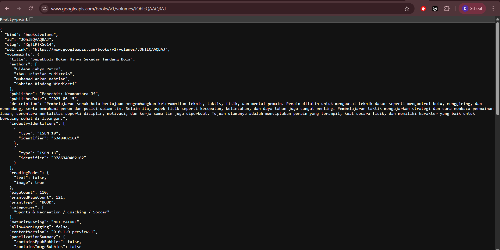
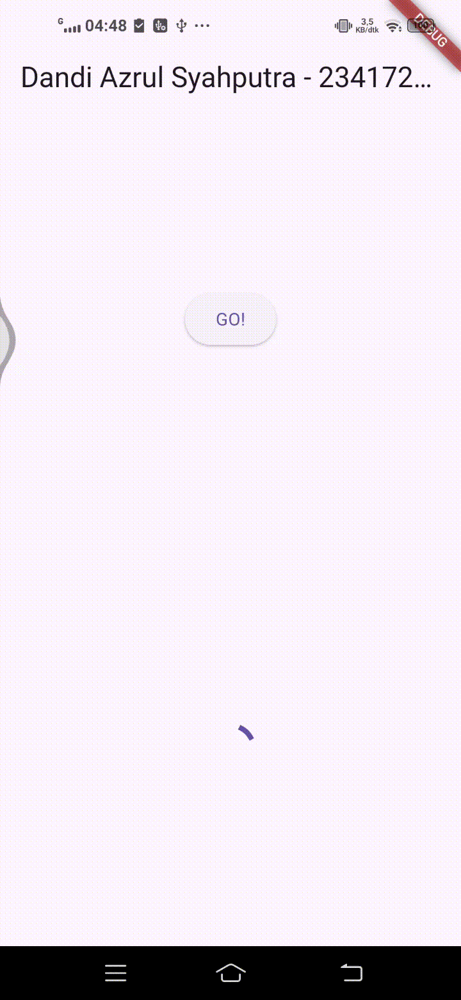
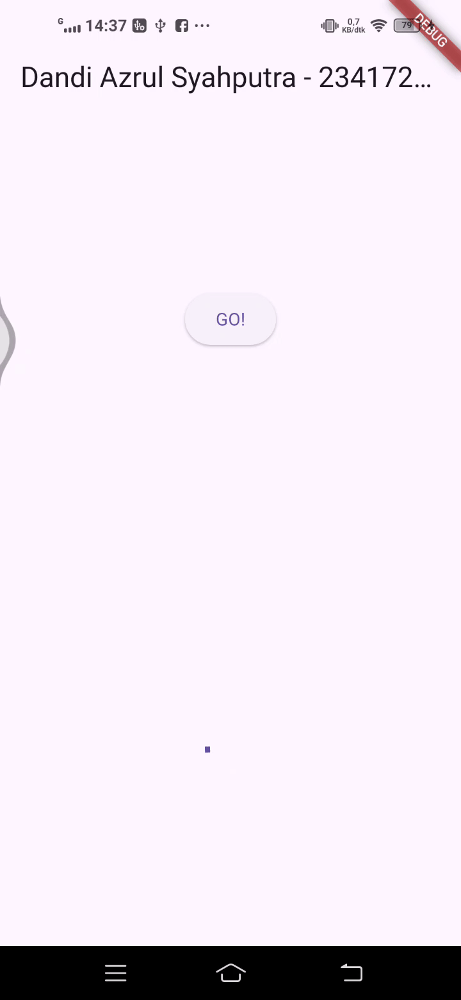
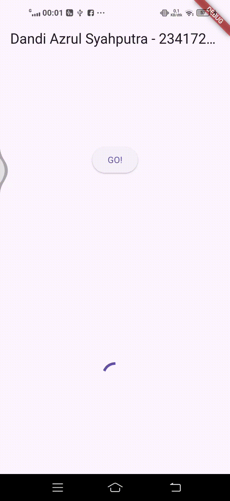
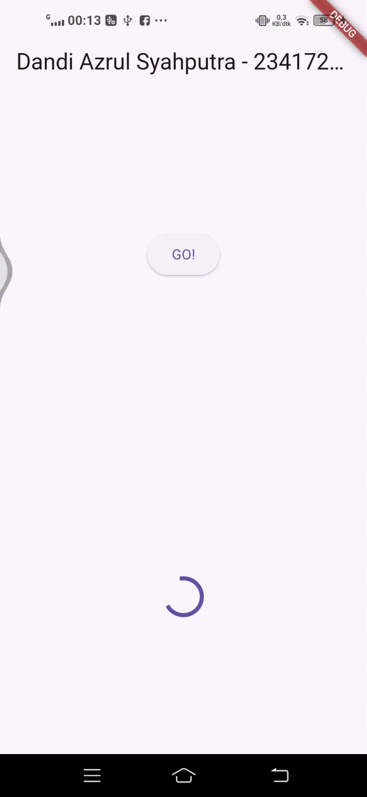
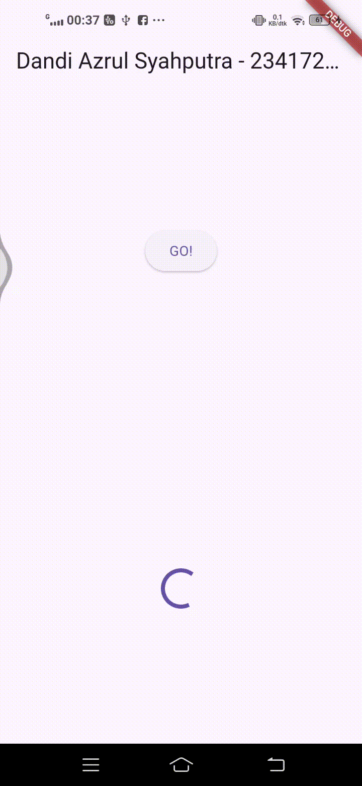
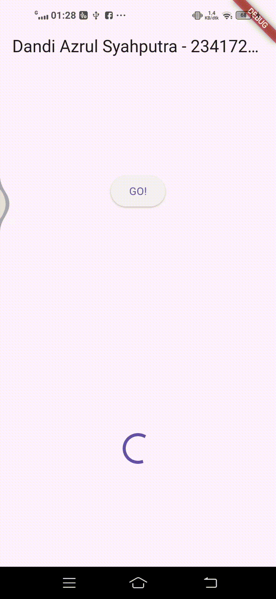

# books

# DANDI AZRUL SYAHPUTRA - 2341720118

Soal 3

Jelaskan maksud kode langkah 5 tersebut terkait substring dan catchError!

- substring(0, 450)
Mengambil 450 karakter pertama dari response body API (yang berupa JSON string panjang). Ini dilakukan agar text yang ditampilkan tidak terlalu panjang dan memenuhi layar.

- catchError
Menangkap error jika terjadi kegagalan saat mengambil data dari API (misal: tidak ada koneksi internet, timeout, atau API error). Jika error terjadi, variabel result akan diisi dengan pesan 'An error occurred' dan UI akan di-update melalui setState().

Soal 4

Langkah 1: Tiga fungsi async masing‑masing menunggu 3 detik lalu mengembalikan 1, 2, 3 (simulasi kerja lambat tanpa blok UI).

Langkah 2: Fungsi count menunggu ketiganya secara berurutan (≈9 detik total), menjumlahkan (hasil 6), lalu setState agar UI menampilkan nilai tersebut.

Soal 5

Jelaskan maksud kode langkah 2 tersebut!

Kode langkah 2 memakai Completer untuk membuat Future yang diselesaikan manual: dideklarasikan late Completer, lalu getNumber() menginisialisasi Completer<int>, memanggil calculate(), dan langsung mengembalikan completer.future; sementara calculate() menunggu 5 detik lalu completer.complete(42), sehingga Future dari getNumber() selesai dengan nilai 42 yang bisa di-then/await oleh pemanggil.

Soal 6

 pada langkah 2 alur hanya meng-happy path—getNumber mengembalikan Future dari Completer dan calculate sekadar menunggu 5 detik lalu selalu complete(42), tanpa propagasi kesalahan sehingga UI tidak tahu jika gagal. Pada langkah 5–6 ditambahkan penanganan error end‑to‑end: calculate dibungkus try/catch dan saat gagal memanggil completer.completeError(...), lalu onPressed memakai then untuk kasus sukses (update result) dan catchError untuk kasus gagal (menampilkan pesan error). 

Soal 7

Soal 8

Jelaskan maksud perbedaan kode langkah 1 dan 4!

Langkah 1 (FutureGroup)Memakai kelas FutureGroup dari package async. 

Langkah 4 (Future.wait)Memakai API bawaan Dart tanpa paket tambahan.

Soal 9

Soal 10

Langkah 1: Memakai FutureGroup dari package async. Anda membuat objek, menambahkan futures satu per satu, lalu close().

Langkah 4: Memakai Future.wait bawaan Dart. Beri daftar futures sekali, menunggu semuanya selesai lalu mengembalikan List hasil.

Soal 12

Di browser bisa, tapi bukan “GPS murni”. Geolocator web memakai HTML5 Geolocation API: hanya bekerja pada origin aman (HTTPS atau http://localhost) dan setelah pengguna memberi izin. Di desktop/Chrome biasanya hasilnya perkiraan (berdasarkan Wi‑Fi/IP), sehingga kurang akurat; jika izin ditolak atau berjalan di konteks tidak aman, koordinat tidak akan didapat.

Soal 13

Ya, ada perbedaan. Sekarang UI memakai FutureBuilder yang bereaksi ke status Future: saat waiting menampilkan CircularProgressIndicator, dan saat done menampilkan koordinat. Pada praktikum sebelumnya Text hanya di-update lewat setState setelah data didapat, sehingga loading tidak terlihat. Penambahan delay 3 detik makin membuat state waiting terlihat.

## Getting Started

This project is a starting point for a Flutter application.

A few resources to get you started if this is your first Flutter project:

- [Lab: Write your first Flutter app](https://docs.flutter.dev/get-started/codelab)
- [Cookbook: Useful Flutter samples](https://docs.flutter.dev/cookbook)

For help getting started with Flutter development, view the
[online documentation](https://docs.flutter.dev/), which offers tutorials,
samples, guidance on mobile development, and a full API reference.
