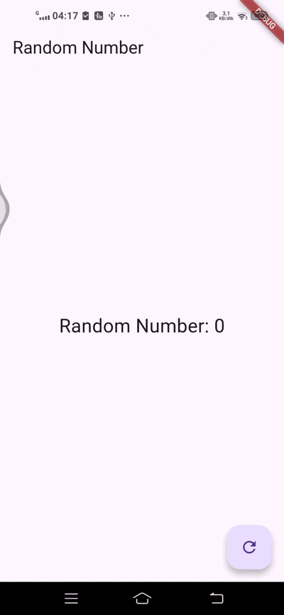

# bloc_random_dandi

Mempelajari BLoC Pattern untuk memisahkan logika bisnis dari UI menggunakan Stream sebagai jembatan komunikasi antara UI dan Business Logic.

 Letak Konsep BLoC
1. BLoC Layer (random_bloc.dart)

class RandomNumberBloc {
  // INPUT: Terima event dari UI
  final _generateRandomController = StreamController<void>();
  StreamSink<void> get generateRandom => _generateRandomController.sink;
  
  // LOGIC: Proses bisnis (generate random)
  RandomNumberBloc() {
    _generateRandomController.stream.listen((_) {
      final random = Random().nextInt(10); // ← LOGIC BISNIS
      _randomNumberController.sink.add(random);
    });
  }
  
  // OUTPUT: Kirim state ke UI
  final _randomNumberController = StreamController<int>();
  Stream<int> get randomNumber => _randomNumberController.stream;
}

2. UI Layer (main.dart)

class _RandomScreenState extends State<RandomScreen> {
  final _bloc = RandomNumberBloc(); // Instance BLoC
  
  Widget build(BuildContext context) {
    return StreamBuilder<int>(
      stream: _bloc.randomNumber, // ← TERIMA State dari BLoC
      builder: (context, snapshot) {
        return Text('${snapshot.data}'); // Tampilkan data
      },
    );
    
    FloatingActionButton(
      onPressed: () => _bloc.generateRandom.add(null), // ← KIRIM Event ke BLoC
    );
  }
}

A new Flutter project.

## Getting Started

This project is a starting point for a Flutter application.

A few resources to get you started if this is your first Flutter project:

- [Lab: Write your first Flutter app](https://docs.flutter.dev/get-started/codelab)
- [Cookbook: Useful Flutter samples](https://docs.flutter.dev/cookbook)

For help getting started with Flutter development, view the
[online documentation](https://docs.flutter.dev/), which offers tutorials,
samples, guidance on mobile development, and a full API reference.
