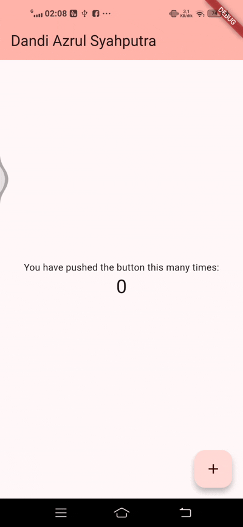
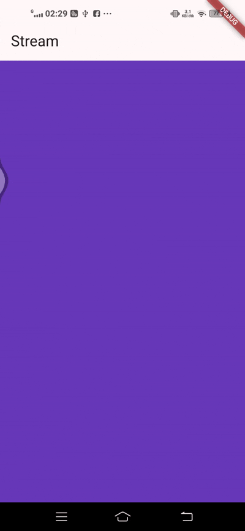

# stream_Dandi Azrul Syahputra
SOAL 1

SOAL 3

yield*: mendelegasikan/menyalurkan semua event dari Stream lain ke Stream ini (forwarding).

Maksud kode: setiap 1 detik Stream.periodic memproduksi indeks t, diubah menjadi index = t % colors.length, lalu mengirim warna pada posisi itu. Hasilnya, getColors() memancarkan warna dari daftar secara berurutan dan berulang tiap detik.

Soal 4

Soal 5

listen: callback-based, returns StreamSubscription; bisa pause/resume/cancel; punya onError/onDone. Wajib cancel di dispose.

await for: loop async yang menunggu event berurutan; selesai saat stream done/break; error via try/catch; tidak ada pause/resume langsung.

A new Flutter project.

## Getting Started

This project is a starting point for a Flutter application.

A few resources to get you started if this is your first Flutter project:

- [Lab: Write your first Flutter app](https://docs.flutter.dev/get-started/codelab)
- [Cookbook: Useful Flutter samples](https://docs.flutter.dev/cookbook)

For help getting started with Flutter development, view the
[online documentation](https://docs.flutter.dev/), which offers tutorials,
samples, guidance on mobile development, and a full API reference.
