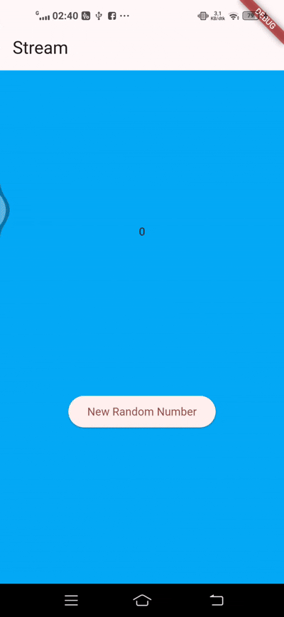
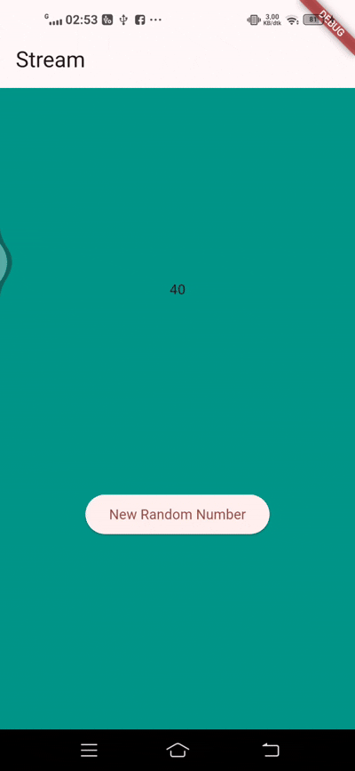
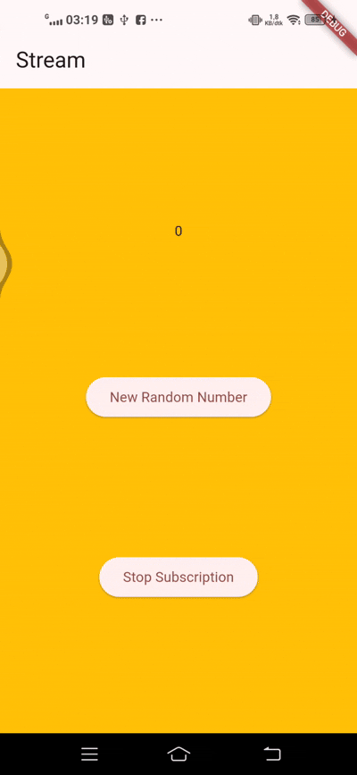
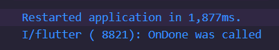
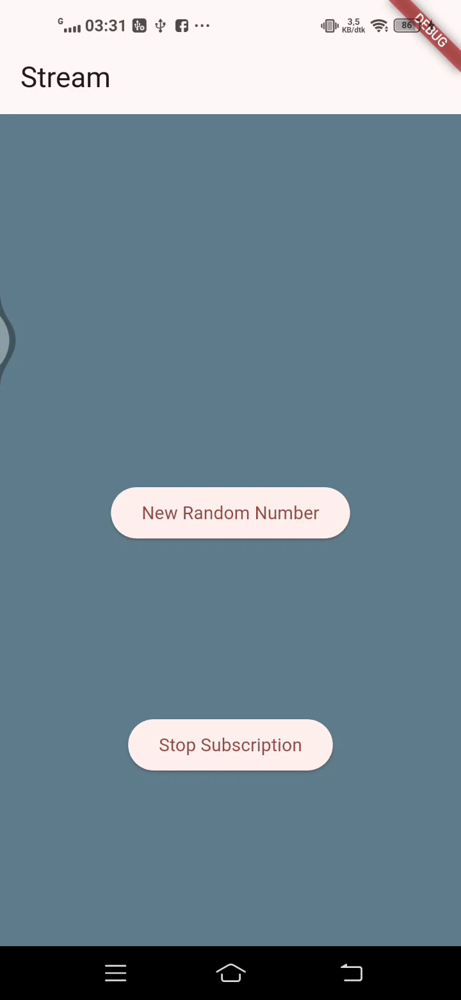

# stream_Dandi Azrul Syahputra
SOAL 1

SOAL 3

yield*: mendelegasikan/menyalurkan semua event dari Stream lain ke Stream ini (forwarding).

Maksud kode: setiap 1 detik Stream.periodic memproduksi indeks t, diubah menjadi index = t % colors.length, lalu mengirim warna pada posisi itu. Hasilnya, getColors() memancarkan warna dari daftar secara berurutan dan berulang tiap detik.

Soal 4

Soal 5

listen: callback-based, returns StreamSubscription; bisa pause/resume/cancel; punya onError/onDone. Wajib cancel di dispose.

await for: loop async yang menunggu event berurutan; selesai saat stream done/break; error via try/catch; tidak ada pause/resume langsung.

Soal 6

Langkah 8 (initState): Inisialisasi NumberStream dan ColorStream, pasang listener pada keduanya. Setiap angka/warna baru datang, setState memperbarui lastNumber dan bgColor. Dibuat sekali saat widget dibuat.

Langkah 10 (addRandomNumber): Buat angka acak 0–9 lalu kirim ke stream lewat addNumberToSink. Listener di initState menerima event dan UI menampilkan angka terbaru.

Soal 7

Langkah 13: Menambah NumberStream.addError() yang mengirim event error ke stream via controller.sink.addError('error').

Langkah 14: Menangani error pada listener di initState dengan onError; saat error diterima, state diubah (mis. lastNumber = -1) agar UI merefleksikan kegagalan tanpa crash.

Langkah 15: addRandomNumber() diubah untuk memicu error (memanggil addError) alih-alih mengirim angka acak, sehingga jalur penanganan error bisa diuji.

Soal 8

Langkah 1: Mendeklarasikan variabel StreamTransformer untuk memproses event sebelum dikonsumsi listener.

Langkah 2: Menginisialisasi transformer dengan fromHandlers:
handleData: setiap angka dikalikan 10 lalu diteruskan.
handleError: saat error, meneruskan nilai pengganti −1.
handleDone: menutup sink.

Langkah 3: Menerapkan transformer pada stream sebelum listen. Akibatnya, UI menerima angka yang sudah ×10 dan jika ada error akan menampilkan −1.
A new Flutter project.

Soal 9

Langkah 2: Menyimpan StreamSubscription ke variabel subscription agar bisa dikontrol (cancel/pause/resume) dan menambahkan handler onError/onDone untuk menangani event error dan stream selesai.

Langkah 6: Di dispose(), membatalkan subscription dengan subscription.cancel() dan menutup controller untuk mencegah memory leak saat widget dihapus.

Langkah 8: Mengecek !numberStreamController.isClosed sebelum mengirim data untuk menghindari error saat mencoba menambah angka ke stream yang sudah ditutup.

Soal 10

Error terjadi karena StreamController default hanya mendukung single-subscription, artinya hanya satu listener yang boleh mendengarkan stream tersebut.

Soal 11

Hal itu terjadi karena ada dua subscription yang mendengarkan stream yang sama (subscription dan subscription2).

## Getting Started

This project is a starting point for a Flutter application.

A few resources to get you started if this is your first Flutter project:

- [Lab: Write your first Flutter app](https://docs.flutter.dev/get-started/codelab)
- [Cookbook: Useful Flutter samples](https://docs.flutter.dev/cookbook)

For help getting started with Flutter development, view the
[online documentation](https://docs.flutter.dev/), which offers tutorials,
samples, guidance on mobile development, and a full API reference.
