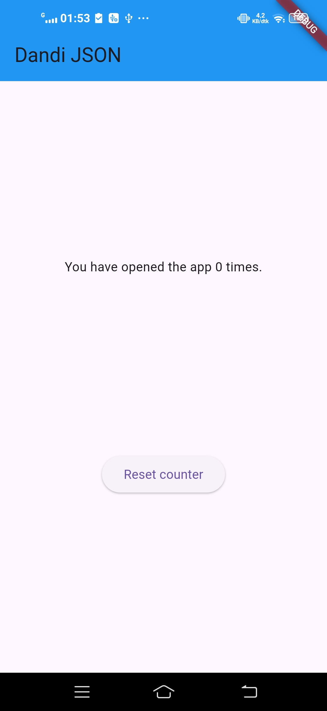
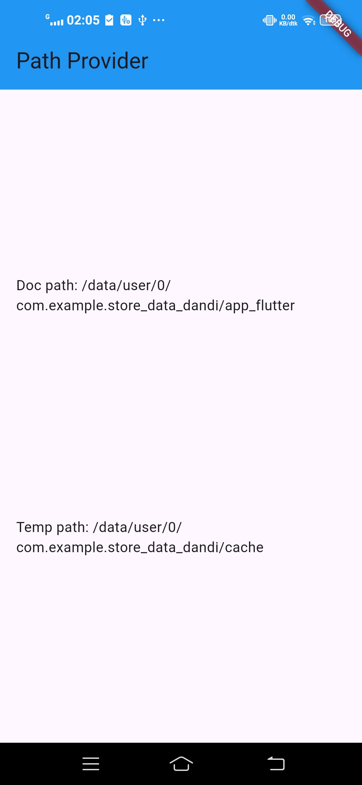
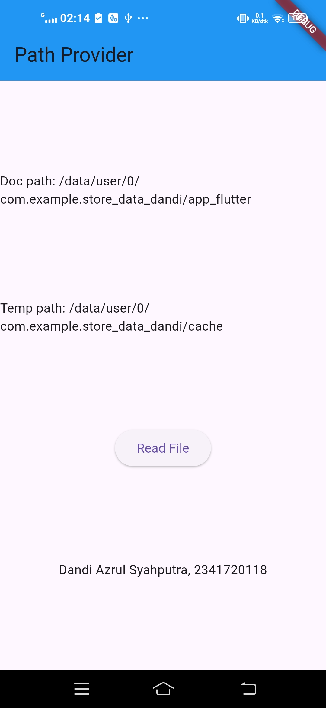

# store_data_dandi


## Soal 5: Penjelasan Kode Lebih Safe dan Maintainable

### Lebih Safe (Aman):
- **Menghindari typo**: Salah ketik konstanta langsung error saat compile, bukan saat runtime
- **Type safety**: IDE deteksi kesalahan tipe data lebih awal
- **Compile-time error**: Bug ketahuan sebelum aplikasi jalan

### Lebih Maintainable (Mudah Dipelihara):
- **Single source**: Ubah nama kunci cukup di satu tempat (konstanta)
- **Refactoring mudah**: IDE bisa rename semua referensi otomatis
- **Konsisten**: Semua kode pakai nama kunci yang sama

**Contoh:**
```dart
// ❌ Sebelum: Rawan typo, sulit maintain
json['pizzaName']  // bisa salah ketik jadi 'pizaName'

// ✅ Sesudah: Safe & maintainable
const keyName = 'pizzaName';
json[keyName]  // typo langsung error
```

---






## Soal 8: Penjelasan Langkah 3 dan 7

### Langkah 3 - writeFile():
```dart
Future<bool> writeFile() async {
  try {
    await myFile.writeAsString('Dandi Azrul Syahputra, 2341720118');
    return true;
  } catch (e) {
    return false;
  }
}
```
- Method async untuk menulis string ke file `pizzas.txt`
- `writeAsString()`: Tulis data ke storage
- `try-catch`: Tangani error (misal: permission denied)
- Return `true` jika berhasil, `false` jika error

### Langkah 7 - initState():
```dart
getPaths().then((_) {
  myFile = File('$documentsPath/pizzas.txt');
  writeFile();
});
```
- `.then()`: Tunggu `getPaths()` selesai dulu
- `File('$documentsPath/pizzas.txt')`: Buat file object dengan path lengkap
- `writeFile()`: Langsung tulis data setelah file dibuat
- Harus pakai `.then()` karena `documentsPath` harus terisi dulu

---




A new Flutter project.

## Getting Started

This project is a starting point for a Flutter application.

A few resources to get you started if this is your first Flutter project:

- [Lab: Write your first Flutter app](https://docs.flutter.dev/get-started/codelab)
- [Cookbook: Useful Flutter samples](https://docs.flutter.dev/cookbook)

For help getting started with Flutter development, view the
[online documentation](https://docs.flutter.dev/), which offers tutorials,
samples, guidance on mobile development, and a full API reference.
